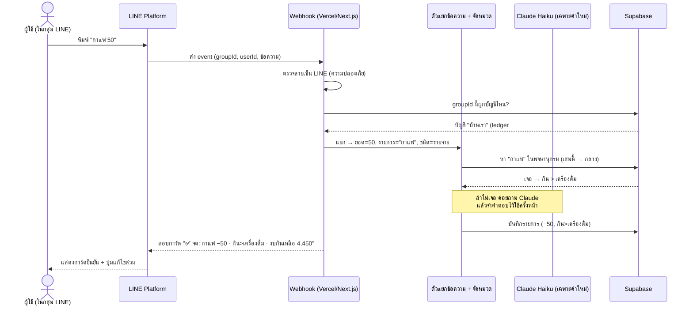

# EunJod (น้องจด) — สเปกระบบ LINE Bot จดรายรับ-รายจ่าย

> **PRD / Feature Spec** — เอกสารความต้องการผลิตภัณฑ์
> เวอร์ชัน: 0.2 · วันที่: 2026-06-21 · เจ้าของ: ต้น (Chaiwat)
> ผู้เขียนสเปก: **Sandalphon** (PM ของสภา) · ผู้สร้าง: **Metatron**
> สถานะ: ✅ เคาะทิศแล้ว (**ใช้ส่วนตัว** · **เปิด OA ใหม่**) — 🛠️ **กำลัง Dev Phase 0–1**
> 📌 เอกสารนี้เป็น **Living Document** — มีสั่งแก้อะไรตอน Dev ต้องกลับมาอัปเดตที่นี่ + SPEC.html เสมอ (ดู §18)

ตัวย่อในเอกสาร: **PRD** = เอกสารความต้องการผลิตภัณฑ์ · **MVP** = รุ่นเล็กสุดที่ใช้ได้จริง · **P0/P1/P2** = ต้องมี / ควรมี / ไว้อนาคต · **OA** = LINE Official Account (บัญชีทางการ)

---

## 1. สรุปสั้น (TL;DR)

บอท LINE ชื่อ **EunJod (น้องจด)** เข้าไปอยู่ใน **กลุ่ม LINE** แล้ว "ฟัง" ข้อความที่สมาชิกพิมพ์
ใครพิมพ์ `กาแฟ 50` บอทก็ **จดเป็นรายจ่าย 50 บาท หมวด กิน > เครื่องดื่ม** ให้อัตโนมัติ แล้วตอบการ์ดยืนยันสั้น ๆ

- **แต่ละกลุ่ม = หนึ่งบัญชี (เล่ม)** — ตั้งด้วย `/setbook ชื่อบัญชี` ข้อมูลแต่ละกลุ่มแยกกันสนิท ไม่ปนกัน
- **จัดหมวดอัตโนมัติ** ด้วยพจนานุกรมคำ + ปัญญาประดิษฐ์ (Claude) เป็นตัวช่วยตอนเจอคำใหม่ และ **เรียนรู้** จากการที่ผู้ใช้แก้
- **รายงานรายเดือน**: พิมพ์ `รายงาน` ในกลุ่ม ได้สรุปรายรับ-รายจ่าย-คงเหลือ แยกหมวด + ลิงก์หน้าเว็บที่มีกราฟ
- ฉลาดพอที่จะ **เงียบ** เมื่อสมาชิกคุยเล่น (ข้อความที่ไม่มีตัวเลขเงิน บอทไม่จด)

**ทำไมคุ้มทำ:** จดบัญชีรายวันคือเรื่องที่ "รู้ว่าควรทำแต่ขี้เกียจเปิดแอป" — ย้ายการจดมาไว้ในที่ที่คนอยู่อยู่แล้ว (แชต LINE) + ตัดงานจัดหมวดทิ้ง = อัตราการจดต่อเนื่องสูงขึ้นมาก ใช้ได้ทั้งครอบครัว ทีมงาน ร้านค้า

---

## 2. ปัญหา (Problem Statement)

คนส่วนใหญ่ "อยากรู้ว่าเงินหายไปไหน" แต่เลิกจดบัญชีกลางคันเพราะ (1) ต้องเปิดแอปแยก (2) ต้องเลือกหมวดเองทุกครั้ง (3) ทำคนเดียว ครอบครัว/ทีมจดร่วมกันไม่ได้ ผลคือไม่มีข้อมูลพอจะตัดสินใจเรื่องเงิน และงบรายเดือนก็คุมไม่ได้จริง ค่าเสียโอกาสคือ "ใช้เงินแบบไม่รู้ตัว" เดือนแล้วเดือนเล่า

---

## 3. เป้าหมาย (Goals)

1. **จดได้ใน 1 ข้อความ ไม่ต้องเลือกหมวด** — ผู้ใช้พิมพ์ `<รายการ> <จำนวน>` แล้วจบ (เป้า: ใช้เวลาจดต่อรายการ < 5 วินาที)
2. **จัดหมวดถูกเองเกิน 80%** หลังบอทเรียนรู้กลุ่มนั้น ~2 สัปดาห์ (วัดจาก % รายการที่ผู้ใช้ไม่ต้องแก้หมวด)
3. **แยกบัญชีต่อกลุ่มได้จริง** — หลายกลุ่ม/หลายทีมใช้บอทตัวเดียวกันโดยข้อมูลไม่ปนกัน 100%
4. **เห็นภาพการเงินรายเดือนได้ทันที** — สั่ง `รายงาน` ได้สรุป + กราฟ ภายในไม่กี่วินาที
5. **จดต่อเนื่อง** — กลุ่มที่เริ่มใช้ ยังจดอยู่หลังผ่านไป 30 วัน (เป้า retention > 50% ของกลุ่มที่ลองใช้)

---

## 4. ไม่ทำในรอบนี้ (Non-Goals)

1. **ไม่ทำเป็นโปรแกรมบัญชีเต็มรูปแบบ** (งบดุล/ภาษี/ใบกำกับ) — นั่นคือ JR ERP / FlowAccount คนละโจทย์ EunJod เน้น "จดเร็ว + เห็นภาพรวม"
2. **ไม่รองรับหลายสกุลเงินใน v1** — บาท (THB) อย่างเดียวก่อน (เผื่อโครงสร้างไว้)
3. **ไม่ทำแชตส่วนตัว (1:1) เป็นฟีเจอร์หลักใน v1** — โฟกัส "กลุ่ม" ตามโจทย์ (แต่คำสั่งพื้นฐานจะใช้ใน 1:1 ได้)
4. **ไม่อ่านใจข้อความกำกวมที่ไม่มีตัวเลข** — ถ้าไม่มีจำนวนเงิน บอทจะไม่เดา (กันจดมั่วในกลุ่มที่คุยเล่น)
5. **ไม่ทำ OCR สลิป/บิล ใน v1** — เลื่อนไป Phase 4 (ออกแบบเผื่อไว้)

---

## 5. ผู้ใช้ & User Stories

**กลุ่มผู้ใช้:** (ก) สมาชิกในกลุ่มที่จดเงิน (บ้าน/คู่รัก/ทีมงาน/ร้าน) (ข) เจ้าของบัญชี/แอดมินกลุ่ม ที่ตั้งค่า+ดูรายงาน

เรียงตามความสำคัญ:

- **(P0)** ในฐานะ**สมาชิกในกลุ่ม** ฉันอยากพิมพ์ `กาแฟ 50` แล้วบอทจดให้พร้อมหมวด เพื่อจดได้เร็วโดยไม่ต้องคิด
- **(P0)** ในฐานะ**แอดมิน** ฉันอยากตั้งว่า "กลุ่มนี้ = บัญชีบ้านเรา" ด้วย `/setbook` เพื่อให้ข้อมูลแต่ละกลุ่มไม่ปนกัน
- **(P0)** ในฐานะ**สมาชิก** ฉันอยากลบ/แก้รายการที่เพิ่งจดผิด (`ลบ`, `แก้ 60`) เพื่อให้ตัวเลขถูกต้อง
- **(P0)** ในฐานะ**แอดมิน** ฉันอยากสั่ง `รายงาน` แล้วได้สรุปรายรับ-รายจ่ายเดือนนี้แยกหมวด เพื่อรู้ว่าเงินไปไหน
- **(P1)** ในฐานะ**สมาชิก** ฉันอยากแก้หมวดที่บอทเดาผิด (`แก้หมวด เดินทาง`) **แล้วบอทจำไว้** เพื่อครั้งหน้าจะถูกเอง
- **(P1)** ในฐานะ**แอดมิน** ฉันอยากตั้งงบต่อหมวด (`/budget กิน 5000`) แล้วได้เตือนเมื่อใกล้/เกินงบ เพื่อคุมการใช้จ่าย
- **(P1)** ในฐานะ**แอดมิน** ฉันอยากให้บอทสรุปยอดให้อัตโนมัติทุกสิ้นวัน/สิ้นเดือน เพื่อไม่ต้องคอยสั่งเอง
- **(P2)** ในฐานะ**สมาชิก** ฉันอยากถ่ายรูปสลิป/บิลแล้วบอทดึงยอดให้ เพื่อจดโดยไม่ต้องพิมพ์
- **(P2)** ในฐานะ**กลุ่มเพื่อน** เราอยากหารบิลกัน (`หาร 1200 /4`) เพื่อรู้ว่าใครจ่ายเท่าไร

---

## 6. ภาพรวมการทำงาน (ลำดับขั้น)

**กรณีคุยเล่น:** ถ้าข้อความไม่มีตัวเลขเงิน (เช่น "หิวจัง") → บอท **เงียบ** ไม่จด ไม่ตอบ (กันรบกวนกลุ่ม)

---

## 7. ความต้องการ + เกณฑ์ยอมรับ (Requirements & Acceptance Criteria)

### 7.1 จดรายการจากข้อความ — P0
แยก "จำนวนเงิน + รายการ + ชนิด (รับ/จ่าย) + โน้ต" จากข้อความธรรมชาติ
- กฎ **จำนวนเงิน:** รองรับเลขมีจุดทศนิยม + ตัวย่อ `k/พัน/หมื่น/ล้าน` (เช่น `5k`=5,000 · `1.5k`=1,500 · `2หมื่น`=20,000) · ถ้ามีหลายเลข ให้เลือกเลขที่ติดกับ "บาท/฿" ก่อน ไม่งั้นเอาเลขท้ายสุด
- กฎ **ชนิด:** ค่าเริ่มต้น = **รายจ่าย** · เป็น **รายรับ** เมื่อขึ้นต้นด้วย `+` หรือมีคำว่า รับ/เงินเดือน/โบนัส/ขายได้/เงินเข้า/รายรับ
- กฎ **รายการ/โน้ต:** ข้อความที่เหลือหลังตัดจำนวน/เครื่องหมาย = ชื่อรายการ · ข้อความหลัง `#` = โน้ต
- **หลายรายการ** ในข้อความเดียว คั่นด้วย `,` หรือขึ้นบรรทัดใหม่
- เพิ่ม (จาก dev): เลขที่ตามด้วย "หน่วยไม่ใช่เงิน" (โมง/นาที/คน/ปี/กม/% ฯลฯ) จะไม่ถูกนับเป็นจำนวนเงิน — กันจดเวลา/จำนวนผิด
- เพิ่ม (ย้อนหลังวัน): รองรับ `เมื่อวาน`/`วานซืน`/`N วันก่อน`/`d/m`/`d/m/ปี` (พ.ศ.หรือ ค.ศ.) → ตั้ง `occurred_at` ตามวันนั้น (ตัดเลขวันออกก่อนหายอด)
- เกณฑ์ยอมรับ (✅ = ผ่าน unit test แล้ว):
  - [x] `กาแฟ 50` → รายจ่าย 50, รายการ "กาแฟ"
  - [x] `50 กาแฟ` (สลับ) → ได้ผลเหมือนกัน
  - [x] `+เงินเดือน 30000` → รายรับ 30,000
  - [x] `ข้าวเที่ยง 60 #ลูกค้า` → รายจ่าย 60, โน้ต "ลูกค้า"
  - [x] `กาแฟ 50, ข้าว 60` → 2 รายการ (รวมถึง `1,200` คั่นหลักพัน, `5k`/`2หมื่น`)
  - [x] `หิวจัง` (ไม่มีเลข) / `ประชุม 10 โมง` (เวลา) → ไม่จด ไม่ตอบ

### 7.2 จัดหมวดหมู่อัตโนมัติ + เรียนรู้ — P0 (เรียนรู้ = P1)
จัดหมวด 2 ระดับ (หมวดใหญ่ > หมวดย่อย) แบบเป็นชั้น:
1. **พจนานุกรมของบัญชีนี้** (คำที่กลุ่มนี้เคยสอน) → 2. **พจนานุกรมกลาง** (ชุดเริ่มต้น) → 3. **จับคำใกล้เคียง** (ตัดเว้นวรรค/สะกดผิด เช่น ชาร์จ/ชาจ/charge) → 4. **ถาม Claude Haiku** (ส่งรายชื่อหมวดไปให้เลือก + ความมั่นใจ แล้ว **จำคำตอบ**ลงพจนานุกรม) → 5. ไม่รู้จริง → หมวด **อื่นๆ** + ชวนผู้ใช้สอน
- เกณฑ์ยอมรับ (✅ = ผ่าน unit test แล้ว):
  - [x] `กาแฟ` → กิน > เครื่องดื่ม · `ทางด่วน` → เดินทาง > ทางด่วน · `ชาจไฟ` → เดินทาง > น้ำมัน/ไฟ
  - [x] คำใหม่ที่ไม่มีในพจนานุกรม ถูกส่งให้ Claude แล้วได้หมวดกลับ + บันทึกใช้ครั้งหน้า (โค้ดพร้อม — ต้องมี `ANTHROPIC_API_KEY` จึงทำงาน)
  - [x] `แก้หมวด เดินทาง > ทางด่วน` กับรายการล่าสุด → อัปเดตรายการ **และ** จำว่าคำนั้น = หมวดนั้นสำหรับบัญชีนี้
  - [x] คำที่บอทไม่มั่นใจ → ลงหมวด "อื่นๆ" + ชวนผู้ใช้สอน (`แก้หมวด ...`)

### 7.3 ผูกกลุ่ม = บัญชี (แยกข้อมูล) — P0
- `/setbook <ชื่อ>` สร้าง/ตั้งชื่อบัญชีของกลุ่มนี้ · คนแรกที่ตั้ง = เจ้าของบัญชี
- ทุก query/รายงาน อิงเฉพาะ `ledger` ของกลุ่มนั้น — ข้อมูลข้ามกลุ่มมองไม่เห็นกัน
- เกณฑ์ยอมรับ:
  - [ ] กลุ่มที่ยังไม่ `/setbook` → บอทเตือนให้ตั้งก่อน (ยังไม่จด)
  - [ ] 2 กลุ่มจดคำเดียวกัน ยอดแยกเล่มกันสนิท
  - [ ] `/book` แสดงชื่อบัญชี + จำนวนรายการเดือนนี้

### 7.4 แก้ไข/ลบ — P0
- `ลบ` (= ลบรายการล่าสุดของกลุ่ม) · `แก้ <จำนวน>` (แก้ยอดล่าสุด) · `แก้หมวด <หมวด>` (แก้หมวดล่าสุด)
- เกณฑ์ยอมรับ: [ ] `ลบ` ถอนรายการล่าสุด + ตอบยืนยัน · [ ] ลบแล้วยอดรวมรายงานเปลี่ยนตาม

### 7.5 รายงาน — P0 (กราฟเว็บ = P1)
- ในกลุ่ม: `วันนี้` / `เดือนนี้` / `เดือนที่แล้ว` / `สรุป` / `รายงาน`
- `รายงาน` = การ์ด Flex: รายรับรวม / รายจ่ายรวม / คงเหลือ / Top หมวด + **ลิงก์หน้าเว็บ** (กราฟวงกลมหมวด + เส้นรายวัน)
- เกณฑ์ยอมรับ:
  - [ ] `เดือนนี้` แสดงรายจ่ายรวม + แยกหมวด เรียงมาก→น้อย
  - [ ] ลิงก์เว็บเปิดได้ เห็นกราฟของบัญชีนั้นเท่านั้น (ผ่าน token หมดอายุได้)
  - [ ] `/export` ส่งไฟล์ CSV/Excel ของเดือนที่เลือก

### 7.6 งบประมาณ + เตือน — P1
- `/budget <หมวด> <จำนวน>` ตั้งงบรายเดือน · บอทเตือนเมื่อใช้ถึง 80% และ 100%
- เกณฑ์ยอมรับ: [ ] ตั้งงบกิน 5,000 แล้วจดจนเกิน → บอทเตือนในกลุ่ม

### 7.7 สรุปอัตโนมัติ — P1
- โพสต์สรุปยอดลงกลุ่มทุกสิ้นวัน (เช่น 21:00) และสรุปเดือนทุกวันที่ 1 (ตั้ง/ปิดได้ด้วย `/digest`)

### 7.8 อนาคต (P2 — ออกแบบเผื่อไว้)
OCR สลิป/บิล · รายการประจำ (recurring เช่นค่าเช่า) · หารบิล (split) · หลายสกุลเงิน · เข้าเว็บด้วย LINE Login · ผูก Google Sheets

---

## 8. ฟังก์ชันที่แนะนำให้มี (คิดต่อให้ — "ใช้ง่าย")

> ต้นขอให้คิดต่อว่าควรมีฟังก์ชันอะไรให้ใช้ง่าย — นี่คือชุดที่ออกแบบมาให้ "พิมพ์น้อย ได้เยอะ"

**A. จด (ไม่ต้องมีคำสั่ง — แค่พิมพ์):**
| พิมพ์ | ผลลัพธ์ |
|---|---|
| `กาแฟ 50` | รายจ่าย 50 · จัดหมวดให้ |
| `+เงินเดือน 30000` | รายรับ 30,000 |
| `ข้าว 60, ทางด่วน 80, ชาจไฟ 120` | จด 3 รายการรวด |
| `ค่าหนัง 300 #เดท` | รายจ่าย 300 + โน้ต "เดท" |
| `กาแฟ 50 เมื่อวาน` · `ข้าว 60 12/6` | **จดย้อนหลังวันได้** (เมื่อวาน/วานซืน/`N วันก่อน`/`d/m`/`d/m/ปี`) |

**B. แก้ไขด่วน:**
`ลบ` (ถอนล่าสุด) · `แก้ 70` (แก้ยอด) · `แก้หมวด เดินทาง` (แก้หมวด + บอทจำ) · `แก้ชื่อ ค่ากาแฟ`

**C. ดูข้อมูล (พิมพ์คำเดียว):**
`วันนี้` · `เดือนนี้` · `สรุป` · `รายงาน` · `หมวด กิน` (เจาะหมวด) · `ค้นหา กาแฟ` · `งบ` (สถานะงบทุกหมวด) · `/cats` (ดูหมวดทั้งหมด — กันลืมตอนตั้งงบ) · `/review` (เปิดหน้าเว็บจัดหมวดรายการที่ยังลง "อื่นๆ" → เลือกหมวดแล้วบอทจำให้) · `/edit` (หน้าแก้ไขรายการที่จดแล้ว: เปลี่ยนหมวด/แก้ยอด-ชื่อ-วัน/ลบ)

**D. ตั้งค่า (ขึ้นต้น `/`):**
`/setbook บ้านเรา` · `/book` · `/budget กิน 5000` · `/cat ชานม = กิน > เครื่องดื่ม` (สอนหมวด) · `/editcat` (เปิดหน้าจัดการหมวด: เปลี่ยนชื่อ/เพิ่ม/ซ่อน/ย้าย) · `/digest on 21:00` (สรุปอัตโนมัติ) · `/export` · `/tz Asia/Bangkok` · `/help`

**E. ฉลาดอัตโนมัติ (บอททำให้เอง):**
- ตอบ **การ์ดยืนยันทุกครั้ง** + ปุ่มแก้ไขด่วน (กดแก้หมวดได้เลย ไม่ต้องพิมพ์)
- **เงียบเมื่อคุยเล่น** (ข้อความไม่มีเลข = ไม่จด)
- **เตือนงบ** เมื่อใกล้/เกิน · **สรุปสิ้นวัน/เดือน** อัตโนมัติ
- **จับรายการผิดปกติ** (ยอดสูงผิดปกติ/จดซ้ำคำเดิม 2 ครั้งใน 1 นาที) → ถามยืนยันกันจดเบิ้ล
- **เรียนรู้ต่อกลุ่ม** — ยิ่งใช้ ยิ่งเดาหมวดแม่นขึ้น

---

## 9. หมวดหมู่เริ่มต้น (Taxonomy)

ชุดเริ่มต้น 2 ระดับ (ดูคำคีย์เวิร์ดเต็ม + ตัวอย่างใน [`categories.seed.md`](categories.seed.md)):

**รายจ่าย:** กิน (อาหาร · เครื่องดื่ม · ขนม/ของว่าง) · เดินทาง (น้ำมัน/ไฟ · ทางด่วน · ที่จอดรถ · แท็กซี่/Grab · ขนส่งสาธารณะ) · ช้อปปิ้ง (ของใช้ · เสื้อผ้า · ของฝาก) · บ้าน/บิล (ค่าน้ำ-ไฟ · เน็ต/มือถือ · ค่าเช่า) · สุขภาพ (ยา/หมอ · ออกกำลังกาย) · บันเทิง (ดูหนัง/สตรีมมิง · เกม/งานอดิเรก) · ครอบครัว/ลูก · งาน/ธุรกิจ · อื่นๆ
**รายรับ:** เงินเดือน · ขายของ/รายได้ · โบนัส · เงินคืน/ดอกเบี้ย · อื่นๆ

ตัวอย่างที่โจทย์ระบุ: `กาแฟ → กิน > เครื่องดื่ม` · `ทางด่วน → เดินทาง > ทางด่วน` · `ชาจไฟ → เดินทาง > น้ำมัน/ไฟ` ✅

---

## 10. สถาปัตยกรรม (Architecture)

- **หน้าบ้านแชต:** LINE Messaging API ผ่าน **LINE OA** (เปิด webhook, ปิด auto-reply, อนุญาตให้เข้ากลุ่ม) — บอทในกลุ่มจะได้รับทุกข้อความผ่าน webhook
- **เซิร์ฟเวอร์:** Next.js (App Router) บน **Vercel** — `app/api/line/webhook/route.ts` (Node runtime, Fluid Compute) ตรวจลายเซ็น `X-Line-Signature` (HMAC-SHA256 ด้วย channel secret) แล้วประมวลผล
- **ฐานข้อมูล:** **Supabase (Postgres)** — เก็บบัญชี/รายการ/หมวด/พจนานุกรม/งบ
- **ตัวจัดหมวด:** พจนานุกรมใน DB เป็นหลัก + **Claude Haiku** (ผ่าน Anthropic API หรือ Vercel AI Gateway) เฉพาะคำใหม่ แล้ว cache → ค่า API ต่ำ
- **รายงานเว็บ:** หน้า Next.js (React + Tailwind) กราฟด้วย Recharts — เข้าผ่านลิงก์ token ต่อบัญชี
- **งานตามเวลา:** Vercel Cron / Supabase scheduled → push สรุปสิ้นวัน/เดือนเข้ากลุ่ม
- **ของลับ (env):** `LINE_CHANNEL_SECRET`, `LINE_CHANNEL_ACCESS_TOKEN`, `ANTHROPIC_API_KEY`, `SUPABASE_URL`, `SUPABASE_SERVICE_ROLE_KEY`

> เลือก stack นี้เพราะตรงกับของที่ต้นใช้อยู่ (Next.js + Supabase + Vercel เหมือน JR ERP / TONPALEARN) — รีไซเคิลความรู้/บัญชี/แพตเทิร์นเดิมได้

---

## 11. โครงสร้างข้อมูล (Data Model) — ตรงกับ `supabase/migrations/0001_init.sql`

> หมายเหตุ (จาก dev): v1 เก็บหมวดเป็น **ข้อความ `cat`/`sub`** บน transactions (ไม่ใช่ category_id) — เรียบง่ายและตรงกับพจนานุกรม · พจนานุกรม "กลาง" อยู่ในโค้ด (`src/data/categories.seed.ts`) ไม่ต้อง seed ลง DB · ตาราง `categories`/`members` ตัดออกจาก v1 (เผื่ออนาคต)

- **ledgers** — `id, source_id (unique = group/room/userId), source_type, name, currency (THB), timezone (Asia/Bangkok), owner_user_id, settings(jsonb), created_at`
- **transactions** — `id, ledger_id, user_id, display_name, type, amount(numeric), item, cat, sub, note, occurred_at, source_message_id, raw_text, created_at, deleted_at(soft delete)`
- **keywords** — `id, ledger_id (null = กลาง), keyword (normalize), type, cat, sub, emoji, source (seed/llm/user), hits` — เก็บคำที่ "เรียนรู้ต่อกลุ่ม"
- **budgets** — `id, ledger_id, cat (null = รวม), period ('month'), amount`
- **report_tokens** — `id, ledger_id, token, expires_at` (ลิงก์เปิดหน้าเว็บรายงาน)
- ดัชนีหลัก: `transactions(ledger_id, occurred_at)`, `keywords(ledger_id, keyword, type)`

---

## 12. ความปลอดภัย & ความเป็นส่วนตัว

- ตรวจลายเซ็น LINE ทุก request (กันคนยิง webhook ปลอม)
- แยกข้อมูลด้วย `ledger_id` ทุก query · บอทไม่ตอบกลุ่มที่ยังไม่ `/setbook`
- หน้าเว็บรายงานเข้าผ่าน token ที่หมดอายุได้ (ไม่เปิดสาธารณะ)
- **PDPA (พ.ร.บ.คุ้มครองข้อมูลส่วนบุคคล):** เป็นข้อมูลการเงินส่วนตัว → เก็บเท่าที่จำเป็น, มี `/export` (ดาวน์โหลด) และ `/forget` (ลบข้อมูลบัญชีทั้งเล่ม)
- ของลับเก็บใน Vercel env เท่านั้น ไม่ฝังในโค้ด

---

## 13. แผนพัฒนาเป็นเฟส (Roadmap)

| เฟส | ได้อะไร (ของส่งมอบ) | ระดับ | ประเมิน |
|---|---|---|---|
| **0 · วางราก** | LINE OA + channel · schema Supabase · โครง Next.js บน Vercel · webhook + ตรวจลายเซ็น + ตอบ echo | P0 | ~2–3 วัน |
| **1 · MVP จดได้จริง** | แยกข้อความ (ยอด+รายการ+ชนิด) · จัดหมวดด้วยพจนานุกรม · `/setbook` ผูกบัญชีต่อกลุ่ม · บันทึก · การ์ดยืนยัน · `ลบ`/`แก้` | P0 | ~4–5 วัน |
| **2 · รายงาน** | `วันนี้`/`เดือนนี้`/`รายงาน` · การ์ด Flex · หน้าเว็บกราฟ · `/export` CSV | P0–P1 | ~4–5 วัน |
| **3 · ฉลาดขึ้น** | Claude จัดหมวดคำใหม่ + เรียนรู้ (`/cat`, `แก้หมวด`) · งบ + เตือน · สรุปอัตโนมัติ (cron) | P1 | ~4–6 วัน |
| **4 · ต่อยอด** | OCR สลิป · recurring · หารบิล · หลายสกุลเงิน · LINE Login · Google Sheets | P2 | backlog |

**MVP ใช้งานได้จริง (เฟส 0–2) ≈ 10–13 วัน-คน** · ครบฟีเจอร์ฉลาด (ถึงเฟส 3) ≈ +1 สัปดาห์

---

## 14. ตัวชี้วัดความสำเร็จ (Metrics)

**สัญญาณเร็ว (วัดเป็นวัน-สัปดาห์):** % ข้อความที่แยกยอดได้สำเร็จ (เป้า >90%) · % จัดหมวดถูกโดยไม่ต้องแก้ (เป้า >80% หลัง 2 สัปดาห์) · เวลาเฉลี่ยจด/รายการ (<5 วิ) · จำนวนรายการ/กลุ่ม/วัน
**สัญญาณช้า (สัปดาห์-เดือน):** กลุ่มที่ยัง active หลัง 30 วัน (>50%) · จำนวนบัญชี/กลุ่มที่ใช้จริง · จำนวนครั้งที่เปิดดูรายงาน/เดือน

---

## 15. การตัดสินใจ + คำถามที่เหลือ (Decisions & Open Questions)

**✅ เคาะแล้ว (2026-06-21):**
- **ใช้งานส่วนตัว/ครอบครัว** — v1 ไม่ทำระบบขายหลายลูกค้า/คิดเงิน (ตัด onboarding + billing ออก) แต่ยังรองรับ "หลายกลุ่ม = หลายบัญชี" ของต้นเอง (เช่น บ้าน / ทีมงาน / ร้าน)
- **เปิด LINE OA ใหม่** เฉพาะ EunJod (แยกจาก OA ส่งข่าวของ Toni) เพราะบอทต้องอ่านทุกข้อความในกลุ่ม คนละโหมดกัน

**คำถามที่เหลือ (ไม่บล็อก — ตัดสินทีหลังได้):**
- ชื่อบอท/แบรนด์: ใช้ "EunJod / น้องจด" (ค่าเริ่มต้น) หรือเปลี่ยน → กระทบ display name + งานภาพ (Gabriel)
- จัดหมวดคำใหม่: เริ่มด้วย **Anthropic API ตรง** ก่อน (ง่ายสุด) · ย้ายไป Vercel AI Gateway ทีหลังได้ถ้าอยากได้ fallback/observability
- สิทธิ์ในกลุ่ม: v1 ให้**ทุกคนในกลุ่มจด/แก้/ลบได้** (ใช้ส่วนตัว เชื่อใจกันในกลุ่ม) — เพิ่ม role ทีหลังถ้าจำเป็น

---

## 16. ความเสี่ยง + ทางลด (Risks)

| ความเสี่ยง | ทางลด |
|---|---|
| ตั้งค่า LINE ผิด บอทไม่ได้รับข้อความกลุ่ม | เช็กลิสต์ตั้งค่า OA (เปิด webhook, อนุญาตเข้ากลุ่ม, ปิด auto-reply) + ทดสอบใน Phase 0 |
| จัดหมวด/แยกยอดผิด → ผู้ใช้เบื่อเลิกใช้ | การ์ดยืนยันทุกครั้ง + แก้ง่าย 1 ปุ่ม + เรียนรู้จากการแก้ |
| ข้อความปนกัน (คุยเล่น vs จดเงิน) จดมั่ว | ต้องมีตัวเลขเงินถึงจะจด · ข้อความไม่มีเลข = เงียบ |
| ค่า API ปัญญาประดิษฐ์บานปลาย | พจนานุกรม cache เป็นหลัก · เรียก Claude เฉพาะคำใหม่ · ใช้รุ่น Haiku (ถูก) |
| ข้อมูลการเงินรั่ว (PDPA) | แยก ledger · token หมดอายุ · `/forget` · ของลับใน env |

---

## 17. เช็กลิสต์ "ทำอะไรต่อ"

| # | สิ่งที่ต้องทำ | เจ้าของ | สถานะ |
|---|---|---|---|
| 1 | เคาะทิศ: ใช้ส่วนตัว + เปิด OA ใหม่ | **ต้น** | ✅ เสร็จ |
| 2 | เขียนสเปก + สเปกเวอร์ชัน HTML อ่านง่าย | **Sandalphon** | ✅ เสร็จ |
| 3 | Dev Phase 0–1: scaffold + parser + จัดหมวด + webhook + จด/ลบ/แก้ + รายงาน | **Metatron** | 🛠️ กำลังทำ |
| 4 | เปิด **LINE OA ใหม่** + Messaging API → ใส่ token ใน `.env.local` | **ต้น** | ⏳ รอ (ดู §19) |
| 5 | สร้าง **Supabase project** + รัน migration ใน `supabase/migrations/` | **ต้น** (+Metatron ช่วย) | ⏳ รอ |
| 6 | Deploy ขึ้น Vercel + ตั้ง Webhook URL ที่ LINE Console | **Metatron** | ⏳ หลังมี token |
| 7 | ออกแบบโลโก้/การ์ดยืนยัน แบรนด์ "น้องจด" | **Gabriel** | คู่ขนาน (ไม่บล็อก) |

---

## 18. เอกสารมีชีวิต + บันทึกการแก้ (Living Document & Change Log)

**กฎ (จากต้น 2026-06-21):** SPEC คือ **แหล่งความจริงเดียว** ของระบบ — **ทุกครั้งที่มีสั่งแก้/เปลี่ยนพฤติกรรมตอน Dev ต้องกลับมาอัปเดต `SPEC.md` + `SPEC.html` ก่อนถือว่างานนั้นเสร็จ** ผู้ดูแลความสอดคล้อง = **Sandalphon (PM)**

| วันที่ | เวอร์ชัน | แก้อะไร | โดย |
|---|---|---|---|
| 2026-06-21 | 0.1 | ร่างสเปกแรก (PRD + หมวดเริ่มต้น + โรดแมป) | Sandalphon |
| 2026-06-21 | 0.2 | เคาะ: ใช้ส่วนตัว + เปิด OA ใหม่ · เพิ่มกฎ Living Document · เพิ่มคู่มือ Setup (§19) · เริ่ม Dev | Sandalphon |
| 2026-06-21 | 0.2.1 | **Build Phase 0–1**: Next.js+Supabase scaffold, parser+จัดหมวด (unit test 25/25 ผ่าน), webhook (smoke test 200), คำสั่งครบ (จด/ลบ/แก้/รายงาน/งบ/สอนหมวด), หน้าเว็บรายงาน · ปรับ data model เป็น text cat/sub (§11) · การ์ดยืนยันเป็น text+quickReply (Flex ไว้ภายหลัง) | Metatron |
| 2026-06-22 | 0.2.2 | **Deploy + go-live**: Supabase migrate (project JinNoi Bot) + e2e จริง, deploy Vercel (upwellness) https://eunjod.vercel.app, LINE OA ต่อ webhook สำเร็จ · **fix:** LINE API host `api.line.biz`→`api.line.me` (reply ล้ม ENOTFOUND) · **เพิ่ม `/cats`** ดูหมวดทั้งหมด + `/budget` เปล่า/ผิดโชว์รายชื่อหมวด (unit test 28/28) | Metatron |
| 2026-06-22 | 0.2.3 | **หน้า Review จัดหมวด**: `/review/[token]` (เว็บ dark glass) โชว์รายการที่ลง "อื่นๆ" → เลือกหมวด (dropdown ตามชนิด รับ/จ่าย) → `POST /api/review/assign` อัปเดต + **เรียนรู้คำ** (learnKeyword) ครั้งหน้าจัดอัตโนมัติ · คำสั่ง `/review` ในบอทสร้างลิงก์ + บอกจำนวนค้าง (unit test 30/30) | Metatron |
| 2026-06-22 | 0.2.4 | **บันทึกย้อนหลังวัน**: parser อ่าน เมื่อวาน/วานซืน/`N วันก่อน`/`d/m`/`d/m/ปี` (พ.ศ.→ค.ศ.) → `occurred_at` ตามวัน + คำยืนยันโชว์ 📅 วันที่ (unit test 35/35) | Metatron |
| 2026-06-22 | 0.2.6 | **หน้าแก้ไขรายการ** `/tx/[token]` + `/api/tx/manage` + `/edit`: เลือกรายการที่จดแล้ว → เปลี่ยนหมวด (dropdown) · แก้ยอด/ชื่อ/วัน/โน้ต · ลบ · เปลี่ยนหมวดแล้วเรียนรู้คำ (วาง trigger ก่อนตัวจับ "แก้" กันชน) · db เพิ่ม `recentTx` | Metatron |
| 2026-06-22 | 0.2.5 | **หน้าจัดการหมวด** `/categories/[token]` + `/api/categories/manage` + `/editcat`: เปลี่ยนชื่อ (rename มีผลเก่า+ใหม่ ผ่าน config `ledgers.settings.catConfig` + bulk update) · เพิ่มหมวด/ย่อย · ซ่อน/แสดง · ย้ายรายการข้ามหมวด · ผูก rename เข้า resolveCategory/`/cats`/`/budget`/review (unit test 41/41) | Metatron |

---

## 19. คู่มือเริ่มใช้งาน (Setup) — สำหรับต้น

ต้องทำ 3 อย่างนี้ก่อนบอทจะทำงานจริง (โค้ดพร้อมแล้ว):

**1) เปิด LINE OA ใหม่ + Messaging API**
1. ไป [LINE Developers Console](https://developers.line.biz/console/) → สร้าง Provider (ถ้ายังไม่มี) → สร้าง **Messaging API channel** ใหม่ ชื่อ "EunJod"
2. ในแท็บ **Messaging API**: คัดลอก **Channel access token** (long-lived) + ในแท็บ **Basic settings**: คัดลอก **Channel secret**
3. ตั้งค่า **Webhook URL** = `https://<โดเมน Vercel ของคุณ>/api/line/webhook` แล้วเปิด **Use webhook** = ON
4. ปิด **Auto-reply messages** + **Greeting messages** (ใน LINE Official Account Manager)
5. เปิด **Allow bot to join group chats** = ON (สำคัญ! ไม่งั้นเข้ากลุ่มไม่ได้)

**2) สร้าง Supabase project**
1. ไป [supabase.com](https://supabase.com) → New project
2. เอา **Project URL** + **service_role key** (Settings → API)
3. รัน SQL ใน `supabase/migrations/` (ผ่าน SQL Editor หรือ `supabase db push`)

**3) ใส่ค่าใน `.env.local`** (คัดจาก `.env.example`) แล้ว `npm install && npm run dev` → deploy `vercel`

